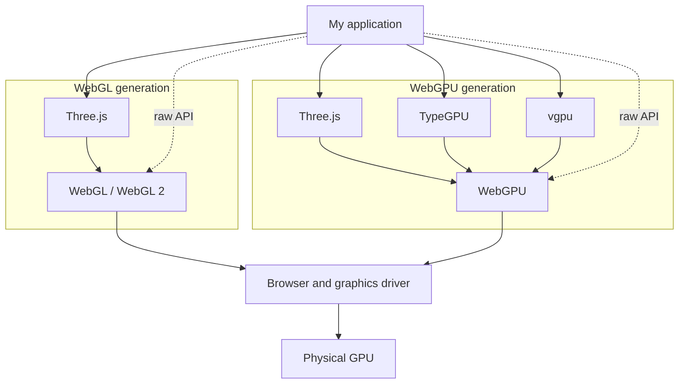

I do not really know much about browser graphics. I barely know anything about graphics programming in general. I played with shaders for like a weekend afternoon, but never stuck with it long enough for any of it to really land.

I've seen some mighty cool Three.js demos on twitter over the years, and lately, a whole lot more 3D demos as people stretch the bounds of Astra, Fable and the rest of them.

Then I saw [Ken Wheeler render his house and turn it into what was essentially a CS:GO map](https://x.com/kenwheeler/status/2096719635416527349?s=20), and thought that was effing cool, he seemed to have a lot of fun building it.

I am writing these notes to figure out what WebGL, WebGPU, Three.js, TypeGPU, `vgpu`, and shaders are, how they fit together, and where I could start picking at this stuff during downtime.

- **WebGL and WebGPU are browser APIs.** They let web pages send work to the GPU.
- **TypeGPU and `vgpu` are TypeScript libraries built on WebGPU.** They make that low-level API easier to use, with different priorities.
- **Three.js is a higher-level 3D library.** It gives me scenes, cameras, lights, materials, geometry, loaders, and renderers.
- **[Shaders](/what-are-shaders/) are programs the GPU runs across many items at once.** A vertex shader positions points; a fragment shader colours parts of the resulting shapes. WebGPU also has compute shaders for work such as image processing. WebGL shaders use [GLSL ES](https://registry.khronos.org/webgl/specs/latest/1.0/#5.8); WebGPU shaders use [WGSL](https://www.w3.org/TR/WGSL/#shader-stages).

**Three.js** describes a 3D scene. **TypeGPU** and **`vgpu`** help build WebGPU programs. **WebGL** and **WebGPU** submit work to the GPU, where **shaders** run on vertices, fragments, or compute items.

## Reading order

1. [WebGL and WebGPU: two generations of browser GPU APIs](/webgl-and-webgpu/)
2. [TypeGPU and vgpu: typed tools above WebGPU](/typegpu-and-vgpu/)
3. [What is Three.js?](/what-is-threejs/)
4. [What are shaders?](/what-are-shaders/)
5. [How browser GPU tools evolved](/browser-gpu-tools-history/)

## Which layer should I reach for?

1. Start with **Three.js** when I want to put a 3D scene on screen quickly.
2. Reach for **TypeGPU** when I want custom WebGPU rendering or computation with strong TypeScript-to-WGSL type safety.
3. Consider **`vgpu`** when I want modular WGSL and the same GPU-oriented code to run in browsers, headless Node, or a deterministic mock.
4. Use **raw WebGPU** when direct control matters more than convenience.
5. Use **WebGL** when its broader compatibility matters, or when an established library already handles it for me.
