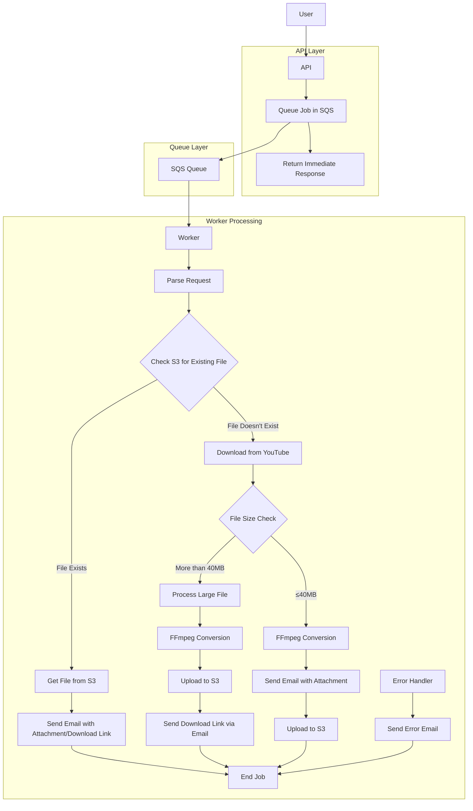



## Resources

- [code](https://github.com/guidefari/yt-dl-proxy)

#### Basic flow diagram

```mermaid
graph TD

    subgraph API Layer
        API --> QueueJob[Queue Job in SQS]
        QueueJob --> ImmediateResponse[Return Immediate Response]
    end

    subgraph Queue Layer
        SQS[SQS Queue]
    end

    subgraph Worker Processing
        Worker[Worker] --> Parse[Parse Request]
        Parse --> CheckS3{Check S3 for Existing File}
        
        CheckS3 -->|File Exists| GetS3[Get File from S3]
        GetS3 --> SendEmail[Send Email with Attachment/Download Link]
        
        CheckS3 -->|File Doesn't Exist| Download[Download from YouTube]
        Download --> SizeCheck{File Size Check}
        
        SizeCheck -->|More than 40MB| ProcessLarge[Process Large File]
        ProcessLarge --> FFmpegLarge[FFmpeg Conversion]
        FFmpegLarge --> UploadS3Large[Upload to S3]
        UploadS3Large --> SendLink[Send Download Link via Email]
        
        SizeCheck -->|≤40MB| FFmpegSmall[FFmpeg Conversion]
        FFmpegSmall --> SendEmailSmall[Send Email with Attachment]
        SendEmailSmall --> UploadS3Small[Upload to S3]
        
        SendEmail --> End[End Job]
        SendLink --> End
        UploadS3Small --> End
        
        Error[Error Handler] --> SendError[Send Error Email]
        SendError --> End
    end


    User --> API
    QueueJob --> SQS
    SQS --> Worker
```